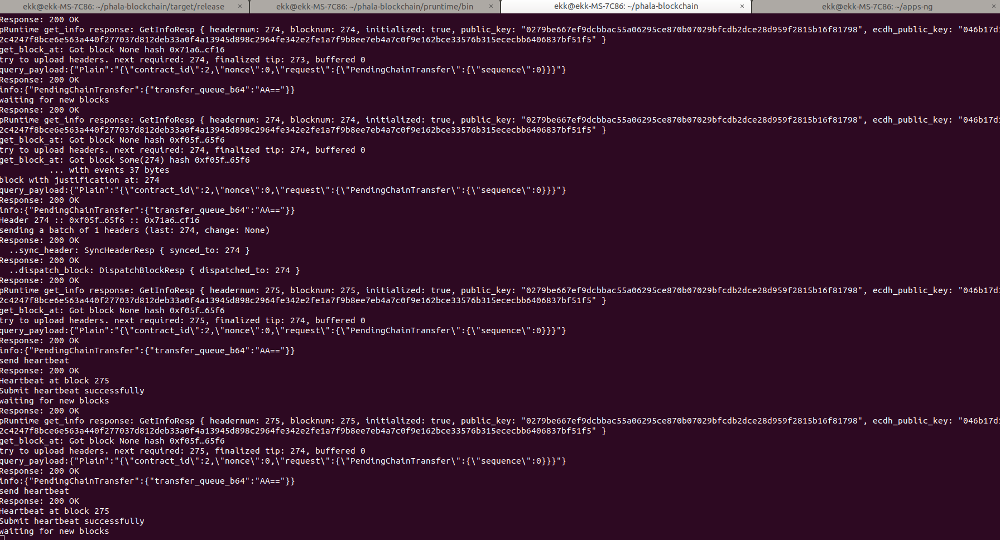

### screenshots of the terminal window with the running core blockchain (phala-node, pruntime, and phost)
+ phala-node 
+ pruntime 
+ phost 

### a screenshot of my user-issued secret token

### the feeling on my twitter
https://twitter.com/PaynXM/status/1317750229635002368